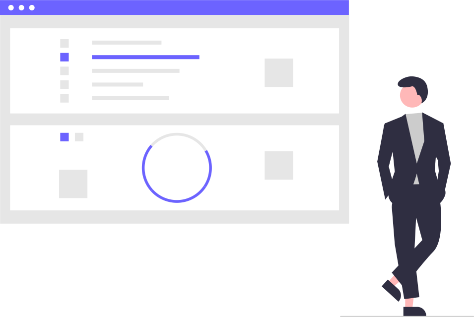

<h1 align="center">Konnichiwa 👋</h1>

 
   

 
## About Me :wave:

    Name = 'Ankit Jha'
    Interests = ['Coding','Youtubing','Anime','Manga','memes']
    Motto = while(!(succeed=try()));
<!--     

 -->
    
<h3 align="left"> Connect with me:</h3>
 

 

<h3 align="left">
Languages and Tools :</h3>
 

                      

##  My GitHub Stats

 

 🡸 Click here 

 

